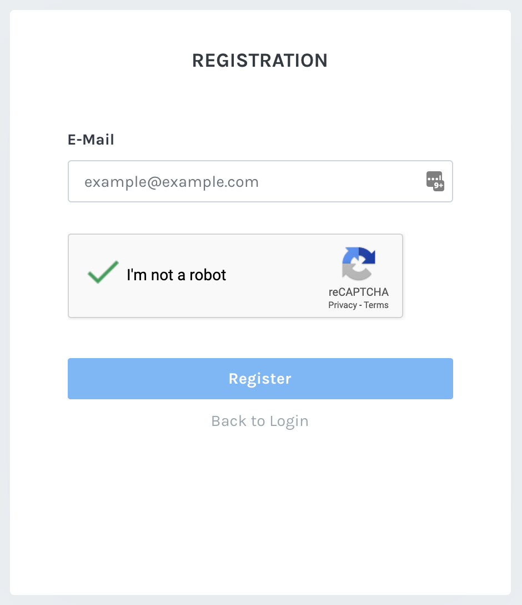

To create an MXC Supernode account, you first need to navigate to the MXC supported Supernode of choice. You can find this list on our [Getting Started](https://mxc.wiki/docs/en/startingUser) page. Once you're at your chosen supernode, follow these instructions. 

## Submit your Email Address
1. Click on "Register"
2. Enter your email address
3. Complete the captcha
4. Click on "Register"

## Create a password
After you enter your email address, you will receive an email from the supernode. *This might land in your spam folder, so if you don't receive the email, check spam.* 
1. Open the email
2. Click the link in the email
3. Enter your password

## Logging in
Now you can use your email address and password to log into your supernode account. 