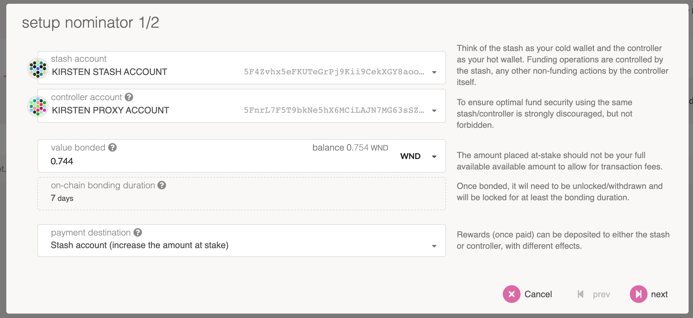
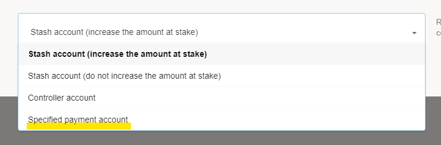
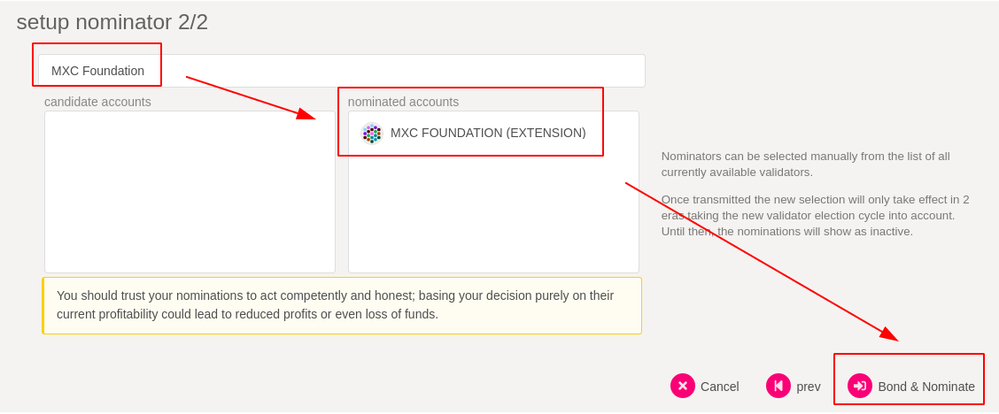

Nominators are one type of participant in the staking subsystem of Polkadot. They are responsible
for appointing their stake to the validators who are the second type of participant. By appointing
their stake, they are able to elect the active set of validators and share in the rewards that are
paid out.

While the validators are active participants in the network that take part in the block
production and finality mechanisms, nominators take a more passive role with a
"set-it-and-forget-it" approach. Being a nominator does not require running a node of your own or
worrying about online uptime. However, a good nominator performs due diligence on the validators
that they elect. When looking for validators to nominate, a nominator should pay attention to their
own reward percentage for nominating a specific validator - as well as the risk that they bare of
being slashed if the validator gets slashed.

## Setting up Stash and Controller keys

Nominators are recommended to set up separate stash and controller accounts. Explanation and
reasoning for generating distinct accounts for this purpose is elaborated in the 
[keys](https://wiki.polkadot.network/docs/en/learn-keys#controller-and-stash-keys) section of
the Polkadot Wiki.

You can generate your stash and controller account via any of the recommended methods that are
detailed on the [account generation](https://wiki.polkadot.network/docs/en/learn-account-generation) page.

Starting with runtime version v23 natively included in client version
[0.8.23](https://github.com/paritytech/polkadot/releases/tag/v0.8.23), payouts can go to any custom
address. If you'd like to redirect payments to an account that is neither the controller nor the
stash account, set one up. Note that it is extremely unsafe to set an exchange address as the
recipient of the staking rewards.

## Using Polkadot-JS UI

### Step 1: Bond your tokens

On the [Polkadot-JS UI](https://polkadot.js.org/apps) navigate to the "Network/Staking" tab.

The "Staking Overview" subsection will show you all the active validators and their information -
their identities, the amount of DOT that are staking for them, amount that is their own provided
stake, how much they charge in commission, the era points they've earned in the current era, and the
last block number that they produced. If you click on the chart button it will take you to the
"Validator Stats" page for that validator that shows you more detailed and historical information
about the validator's stake, rewards and slashes.

The "Account actions" subsection ([link](https://polkadot.js.org/apps/#/staking/actions)) allows you
to stake and nominate.

The "Payouts" subsection ([link](https://polkadot.js.org/apps/#/staking/payouts)) allows you to
claim rewards from staking.

The "Targets" subsection ([link](https://polkadot.js.org/apps/#/staking/targets)) will help you
estimate your earnings and this is where it's good to start picking favorites.

The "Waiting" subsection ([link](https://polkadot.js.org/apps/#/staking/waiting)) lists all pending
validators that are awaiting more nominations to enter the active validator set. Validators will
stay in the waiting queue until they have enough DOT backing them (as allocated through the
[Phragmén election mechanism](https://wiki.polkadot.network/docs/en/learn-phragmen)). It is possible
validator can remain in the queue for a very long time if they never get enough backing.

The "Validator Stats" subsection ([link](https://polkadot.js.org/apps/#/staking/query)) allows you
to query a validator's stash address and see historical charts on era points, elected stake,
rewards, and slashes.

Pick "Account actions", then click the "+ Nominator" button.

You will see a modal window that looks like the below:

Select a "value bonded" that is **less** than the total amount of DOT you have, so you have some
left over to pay transaction fees. Transaction fees are currently around 0.01 DOT, but they are
dynamic based on a variety of factors including the load of recent blocks.

Also be mindful of the reaping threshold - the amount that must remain in an account lest it be
burned. That amount is 1 DOT on Polkadot, so it's recommended to keep at least 1.5 DOT in your
account to be on the safe side.

Choose whatever payment destination that makes sense to you. If you're unsure, you can choose "Stash
account (increase amount at stake)" to simply accrue the rewards into the amount you're staking and
earn compound interest.

> These concepts have been further explained in Polkadot's
> [UI Walkthrough Video](https://www.youtube.com/watch?v=mNStMPZjiHM&list=PLOyWqupZ-WGuAuS00rK-pebTMAOxW41W8)

### Step 2: Nominate a validator

You are now bonded. Being bonded means your tokens are locked and could be
[slashed](https://wiki.polkadot.network/docs/en/learn-staking#slashing) if the validators you nominate misbehave. All bonded funds can now
be distributed to up to 16 validators. Be careful about the validators you choose since you will be
slashed if your validator commits an offence.

Click on "Nominate" on an account you've bonded and you will be presented with another popup asking
you to select up to 16 validators. Although you may choose up to 16 validators, due to the
[Phragmén](https://wiki.polkadot.network/docs/en/learn-phragmen) election algorithm your stake 
may be dispersed in different proportions to any subset or all of the validators your choose.

Search and select the "MXC Foundation" validator, confirm the transaction, and you're done - you are now nominating. **Your nominations
will become active in the next era.** Eras last twenty-four hours on Polkadot - depending on when you
do this, your nominations may become active almost immediately, or you may have to wait almost the
entire twenty-four hours before your nominations are active. You can chek how far along Polkadot is
in the current era on the [Staking page](https://polkadot.js.org/apps/#/staking).

Assuming at least one of your nominations ends up in the active validator set, you will start to get
rewards allocated to you. In order to claim them (i.e., add them to your account), you must manually
claim them. See the [Claiming Rewards](https://wiki.polkadot.network/docs/en/learn-staking#claiming-rewards) section of the Staking wiki
page for more details.

### Step 3: Stop nominating

At some point, you might decide to stop nominating one or more validators. You can always change who
you're nominating, but you cannot withdraw your tokens unless you unbond them. Detailed instructions
are available [here](https://wiki.polkadot.network/docs/en/maintain-guides-how-to-unbond).

